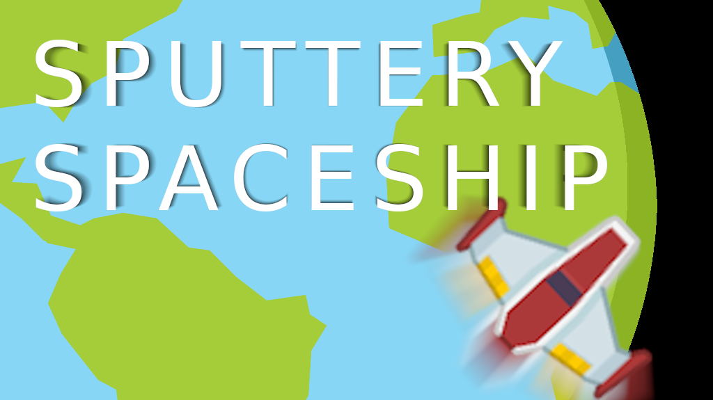

**Sputtery Spaceship** is a Flappy Bird inspired endless space shooter built with [Godot](https://godotengine.org/) and using [Kenney Assets](https://kenney.nl/assets) for graphics and sound.

You can give it a try @ [itch.io](https://yokelpole.itch.io/sputtery-spaceship). It's also available on the Google Play store if you're in Canada or the United States.

If you're interested in messing with the source code it's probably best if you use Godot 3.2, as I haven't tested it against any other versions.